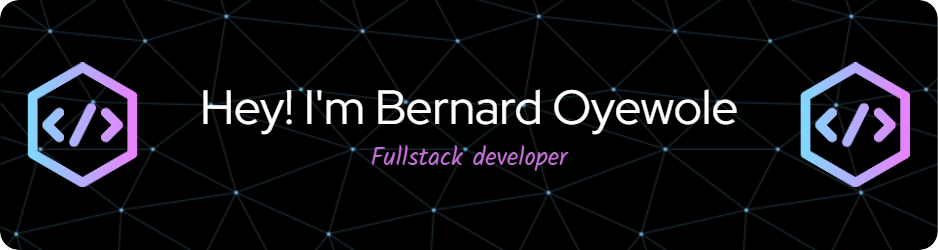

## About me
Hello, world. I'm Bernard Oyewole, a recent graduate in Software Development from Manitoba Institute of Trades and Technology.

Check out my portfolio [here](https://bernardoyewole.github.io/portfolio/)

I am mastering my skills in full-stack development by working on several projects that demonstrate my ability to deliver effective digital and business solutions.

My career goal is to positively impact lives with innovative solutions, all crafted from behind my trusty, quirky keyboard.
##

### My skills

  &nbsp;
  &nbsp;
  &nbsp;
  &nbsp;
  &nbsp;
  &nbsp;
  
  
  
  
  
  
  
  

##

##

### My stats

<!--
**bernardoyewole/bernardoyewole** is a ✨ _special_ ✨ repository because its `README.md` (this file) appears on your GitHub profile.

Here are some ideas to get you started:

- 🔭 I’m currently working on ...
- 🌱 I’m currently learning ...
- 👯 I’m looking to collaborate on ...
- 🤔 I’m looking for help with ...
- 💬 Ask me about ...
- 📫 How to reach me: ...
- 😄 Pronouns: ...
- ⚡ Fun fact: ...
-->
